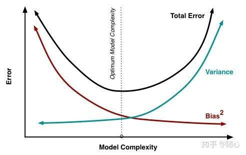

# Interview Questions-Deep Learning

### 梯度消失和梯度爆炸(2024.9.2)

参考：

[深度学习之3——梯度爆炸与梯度消失 - 知乎 (zhihu.com)](https://zhuanlan.zhihu.com/p/68579467)

[深度学习中梯度消失和梯度爆炸的根本原因及其缓解方法_什么是梯度消失-CSDN博客](https://blog.csdn.net/weixin_46470894/article/details/107145207)

[详解机器学习中的梯度消失、爆炸原因及其解决方法_梯度消失的原因及解决方法-CSDN博客](https://blog.csdn.net/qq_25737169/article/details/78847691)

#### 概念

对于深层神经网络$F(x) = f_n(...f_3(f_2(f_1(x)*w+b)*w+b)*w+b)$

$Loss = || g(x) - f(x) ||^2$

$\Delta{w_2}=\frac{\delta{f_n}}{\delta{f_{n-1}}}·\frac{\delta{f_{n-1}}}{\delta{f_{n-2}}}\dots\frac{\delta{f_2}}{\delta{w_2}}$

这里前n-2个项都可看作对激活函数求导，很多激活函数值域在(0,1)，当层数过多时多个导数相乘会趋于0，梯度消失；当激活函数梯度值全在1以上时会梯度爆炸

#### 梯度爆炸的问题

+ 值超出值域(infinity)

对于16位浮点数尤为严重（

+ 对学习率敏感

#### 解决方案

1. 梯度剪切

设置一个梯度剪切阈值；更新梯度时，超过或低于某范围，强制更新到该范围内

2. 权重正则化

$ Loss = (y-W^Tx)^2 +\alpha||W||^2 $

3. 采用其他激活函数

**Relu：**正数部分导数为1，连乘不会趋于0或无穷

**缺点：**

- 由于负数部分恒为0，会导致一些神经元无法激活（可通过设置小学习率部分解决）
- 输出不是以0为中心的

**LeakRelu:**
`LeakRelu`就是为了解决Relu的0区间带来的影响，其数学表达为：

$LeakRelu = max(k∗x, x) $

其中k是leak系数，一般选择0.01或者0.02，或者通过学习而来。

**elu:**

$elu(x) = x,if(x>0);else:f(x)= \alpha(e^x-1) $

# ##### 4，5，6待施工#####

4. **Batchnorm**

5. **残差网络**

6. **LSTM — 长短期记忆网络**

### L1正则化和L2正则化（2024.9.3）

**参考：**

[L1正则化与L2正则化的区别_l1正则化和l2正则化的区别是-CSDN博客](https://blog.csdn.net/ybdesire/article/details/84946128)

**L1正则化：**

损失函数增加所有权重绝对值之和(**$|w_1|+|w_2|+\dots+|w_n|$**)，也即L1范数

L1正则化对所有参数的惩罚力度一样（求导均为1），可以让一部分权重变为0，产生稀疏模型，能够使某些特征的权重降为0

**L2正则化（岭回归）：**

损失函数增加所有权重平方和的平方根(**$\sqrt{w_1^2+w_2^2+\dots+w_n^2}$**)，也即L2范数

L2正则化减少了权重的固定比例（求导为$w_i$的正比），使权重平滑。L2正则化不会使权重变为0（不会产生稀疏模型），所以选择了更多的特征。

#### 区别

- L1减少的是一个常量，L2减少的是权重的固定比例
- L1使权重稀疏，L2使权重平滑
- L1优点是能够获得sparse模型，对于large-scale的问题来说这一点很重要，因为可以减少存储空间
- L2优点是实现简单，能够起到正则化的作用。缺点就是L1的优点：无法获得sparse模型

### 交叉熵损失函数和极大似然估计推导（2024.9.4）

参考：chatglm回答

**交叉熵损失函数：**

对样本$(x^{(i)},y^{(i)})$和其预测$\hat{y^{(i)}}$（这里$y$为独热编码，$\hat{y}$是一和$y$形状相同的向量，每个位置表示预测为该类的概率）

==$ Loss = -\Sigma_j y^{(i)}_j·log(\hat{y^{(i)}_j}) = -log(\hat{y^{(i)}_t})$==

其中${y^{(i)}_t}=1$，也即第$i$个样本对应的类别下标为$t$

#### 极大似然估计推导

对样本$(x^{(i)},y^{(i)})$和其预测$\hat{y^{(i)}}$**（这里认为$y^{(i)}$是对应类别的下标而非独热编码）**

要最大化的似然为$\prod_{i=1}^n\hat{y^{(i)}_{y^{(i)}}}$，对其取对数得$\sum_{i=1}^{n}ln\hat{y^{(i)}_{y^{(i)}}}$

故需要最小化的是$-\sum_{i=1}^{n}ln\hat{y^{(i)}_{y^{(i)}}}$，也即交叉熵损失函数

### 如何判断模型是否过拟合？(2024.9.5)

训练集loss低，测试集loss高不一定是过拟合

**参考：**

[回归模型偏差&方差&残差 - 知乎 (zhihu.com)](https://zhuanlan.zhihu.com/p/50214504)

**模型偏差和方差：**

模型偏差(bias)：预测结果与真实值之间的差异，用于衡量模型的准确率

模型方差(variance)：多个模型之间比较的指标

### 求似然函数步骤(2024.9.6)

- 定义：概率是给定参数，求某个事件发生概率；似然则是给定已发生的事件，估计参数。

1. 写出似然函数
2. 对似然函数取对数并整理
3. 求导数，导数为0处为最佳参数
4. 解似然方程

### softmax防止指数上溢工程化实现(2024.9.8)

参考：[万字秋招算法岗深度学习八股文大全 - 知乎 (zhihu.com)](https://zhuanlan.zhihu.com/p/667048896)

# $softmax(x) = \frac{e^{x_i}}{\sum_ie^{x_i}} = \frac{e^{x_i-a}}{\sum_ie^{x_i-a}}$

（使$a$为$x_i$中的最大值）

### 常用优化器

参考：[万字秋招算法岗深度学习八股文大全 - 知乎 (zhihu.com)](https://zhuanlan.zhihu.com/p/667048896)

#### SGD 梯度下降法 (2024.9.9)

$w_{t+1} = w_t - η_t=w_t-\alpha·g_t$

**优点**：每次只用一个样本更新模型参数，训练速度快；很快就能达到局部最优

**缺点**：容易陷入局部最优；沿陡峭方向振荡，而沿平缓维度进展缓慢，难以迅速收敛

#### SGD with momentum 带动量的SGD (2024.9.10)

**思路：**让参数的更新具有惯性，每一步更新都是由前面梯度的累计v和当前点梯度g组合而成

带有动量(momentum)的SGD

**动量$v$：**

更新动量项 $v$，它是当前梯度$∇_θJ(θ)$和前一个动量项 $v$ 的加权平均：

$v_t=\alpha v_{t−1}+(1-\alpha)⋅∇_θJ(θ)$

再根据动量来更新参数：

$w_{t+1}=w_t-η·v_t$

**优点：**可借助动量跳出局部最优点；更具有鲁棒性（对学习率没那么敏感）

**缺点：**容易在局部最优点里来回振荡

#### AdaGrad 自适应学习率优化算法 (2024.9.11)

**思想：**对于不同参数，设置不同的学习率

方法：对于每个参数，初始化一个累计平方梯度r=0，然后每次将该参数的梯度平方求和累加到这个变量r上：

$r←r+g^2(g是梯度)$

然后，在更新这个参数的时候，学习率就变为：

$η←\frac{η}{\sqrt{r+δ}}(δ为小参数，防止分母为0)$

后同SGD

**优点：**稀疏数据场景下表现好；自适应调节学习率

**缺点**：$r$单调递增，使得学习率单调递减为0，从而使得训练过程过早结束。

#### RMSProp (2024.9.12)

AdaGrad的改进版，不累计所有历史梯度，而是过去一段时间窗口内的历史梯度

$r←λr+(1-λ)g^2$

其他的相同

**优点：**避免了二阶动量持续累积、导致训练过程提前结束的问题了。

#### Adam 汇总上面所有 (2024.9.13)

首先是定义了向量$v$：

$v_t = \alpha v_{t-1} + (1-\alpha)g_t$

偏差纠正：

$\hat{v}_n = \frac{v_t}{1-\alpha^t}$

其次是累计平方梯度$r$：

$r_t = \lambda r_{t-1}+(1-\lambda)g^2$

偏差纠正：

$ \hat{r_t} = \frac{r_t}{1-\lambda^n}$

最后更新参数：

$ w ← w - \frac{η}{\sqrt{\hat{r_t}+δ}}·\hat{v_n}$

### ROC曲线、AUC(2024.9.20)

参考：[【小萌五分钟】机器学习 | 模型评估: ROC曲线与AUC值_哔哩哔哩_bilibili](https://www.bilibili.com/video/BV1wz4y197LU/?spm_id_from=333.337.search-card.all.click&vd_source=73e54c2ac162fbf942d5792a881e18b2)

$ TPR = \frac{TP}{P}=\frac{TP}{TP+FN}$

$FPR=\frac{FP}{N}=\frac{FP}{FP+TN}$

ROC曲线：横坐标为FPR，纵坐标为TPR

AUC：ROC曲线下的面积，越大分类效果越好

## 训练过程中发现loss快速增大应该从哪些方面考虑?(2024.9.25)

1. 学习率过大
2. 训练样本中有坏数据

